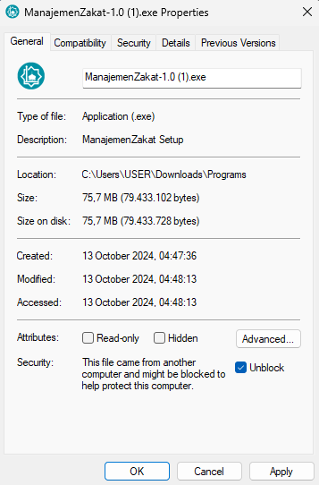
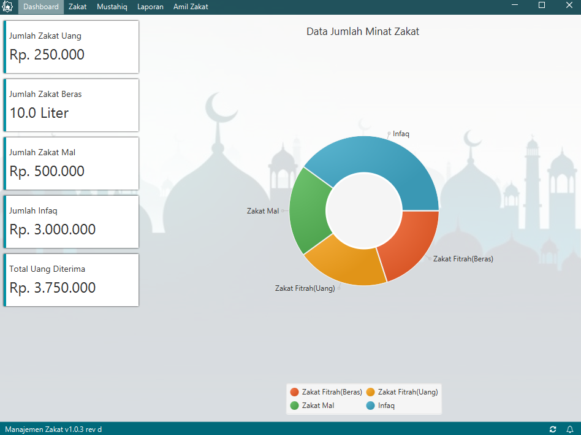
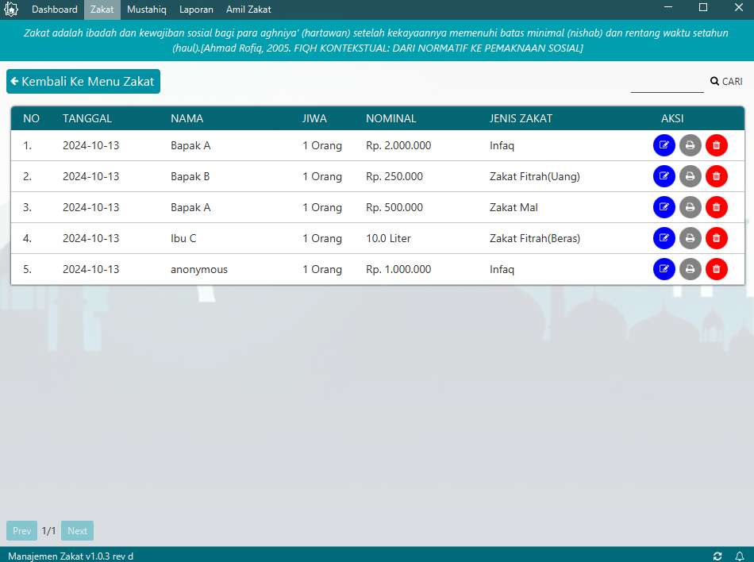

# aplikasi manajemen-zakat
[Klik untuk download](https://github.com/rizalmf/manajemen-zakat/releases)

## Kalau baru install, pakai user default
**username**: admin
**password**: admin

## Cara install
1. Jika windows 11. Klik kanan file install -> properties, kemudian unblock security(jika ada). ini di butuhkan karena aplikasi ini tidak terdaftar di Microsoft Store.
   

3. simpan (klik OK). Kemudian bisa di buka file dan lanjutkan proses instalasi.

## Screenhots

## Note
Untuk saat ini hanya bisa digunakan di os Windows. Insyaallah untuk os lain akan saya update lagi.
Semoga bermanfaat dan barokah untuk kita semua. Amin

Thankyou
